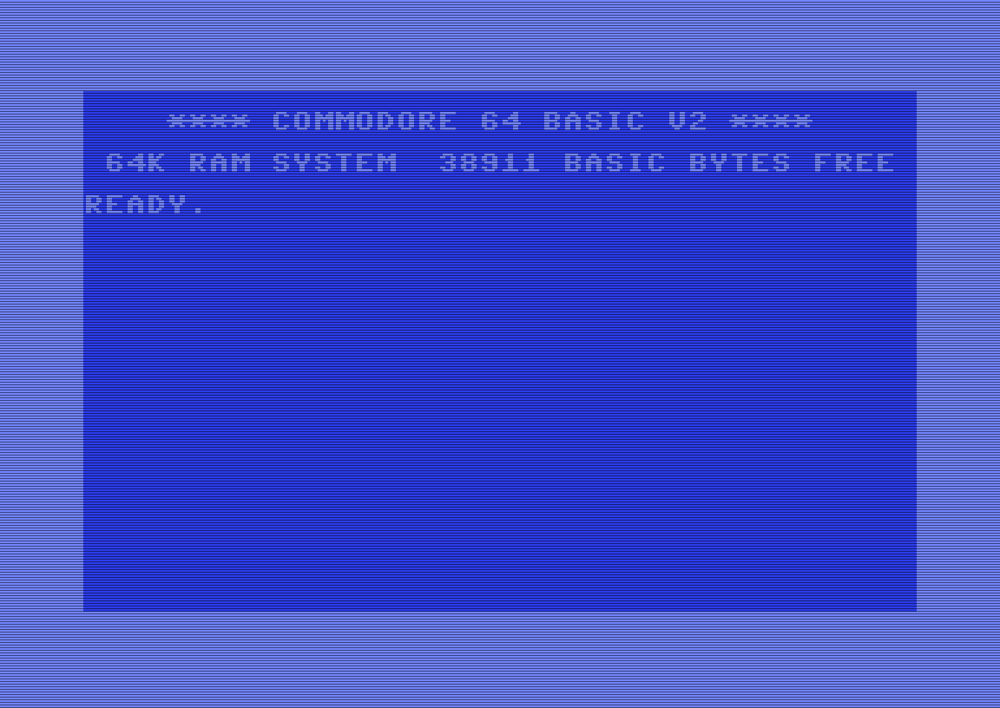
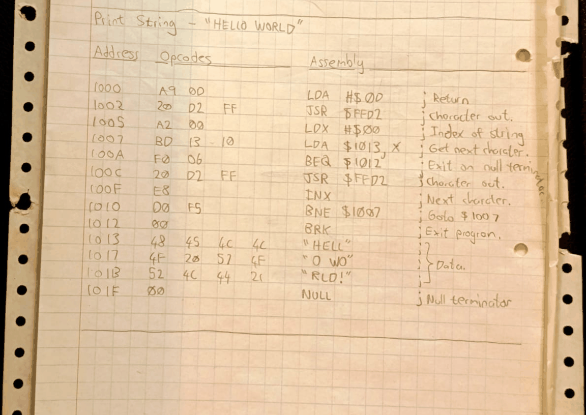

# Code Probe


|||
|:---:|:---:|
|||

A lightweight machine language monitor for the Commodore 64, written in 6502 assembly.

- Inspect and modify memory with a full-screen hex dump and interactive alter mode.
- View and set the shadow CPU registers and processor status flags.
- Fill, transfer, save, load, and execute machine language programs from the keyboard.
- Loads at `$C000` and returns control to the monitor via a patched BRK vector.

## Overview

Code Probe is a software-based alternative to hardware cartridge monitors such as Action Replay. The current version, 2.1, is an assembly language restoration of the disassembled machine code of the original 1988 version, optimized for maintenance and further development with Kick Assembler. 

The design of `Code Probe` was inspired by the DOS `DEBUG` utility, and presents a similar terminal-style user interface and commands. All numeric input is hexadecimal. Addresses are 4 digits, byte values are 2 digits, and device numbers are 2 digits.

### Features

- **Memory Inspection** - Hex dump with ASCII character display.
- **Memory Editing** - Interactive alter mode with cursor navigation and auto-advance.
- **Register Management** - View and modify all CPU registers and processor status flags.
- **Memory Operations** - Fill and transfer (copy) arbitrary blocks of memory.
- **File I/O** - Save and load PRG and SEQ files to/from disk.
- **Program Execution** - Run machine language programs with a full shadow register load and BRK-based return to the monitor.
- **Directory Listing** - List files on a connected disk device.
- **Screen Control** - Clear the display with a single command.
- **Exit to BASIC** - Exit to BASIC and return to Code Probe with `SYS 49152`.

## Loading and Starting

Code Probe loads at address `$C000` (49152 decimal) and occupies approximately 4 KB of RAM in the `$C000`--`$CFFF` region. The KERNAL remains banked in, so all KERNAL routines remain available to loaded programs.

### From Disk

```
LOAD "CODEPROBE",8,1
SYS 49152
```

The `,8,1` parameter loads the program to its native address (`$C000`) rather than the default BASIC area. After loading, `SYS 49152` transfers control to Code Probe.

### From VICE Emulator

Use the VICE **Autostart** feature to load `codeprobe.prg` directly, or type the `LOAD` and `SYS` commands above at the BASIC prompt.

### What Happens at Startup

1. Screen is cleared, colors set, and title banner displayed, `CODE PROBE (2.1) - ROHIN GOSLING`.
2. The BRK interrupt vector is installed (enabling return from executed programs).
3. Shadow registers are initialized to default values.
4. The monitor prompt (`: `) appears.

## Command Reference

All address and count values are hexadecimal. Addresses are 4 digits, byte values are 2 digits, device numbers are 2 digits (typically `08` for disk).

| Command | Syntax                                           | Description                                     |
|---------|--------------------------------------------------|-------------------------------------------------|
| `D`     | `D <start> <end>`                                | Hex dump memory from start to end (inclusive).  |
| `A`     | `A <address>`                                    | Enter alter mode to write hex bytes to RAM.     |
| `R`     | `R`                                              | Display all shadow registers.                   |
| `R`     | `R <register> <value>`                           | Set a shadow register.                          |
| `RF`    | `RF`                                             | Display registers with expanded flag bits.      |
| `RF`    | `RF <flag> <0\|1>`                               | Set an individual processor status flag.        |
| `F`     | `F <address> <count> <value>`                    | Fill memory with a byte value.                  |
| `T`     | `T <source> <count> <destination>`               | Copy memory from source to destination.         |
| `G`     | `G <address>`                                    | Execute machine code at address.                |
| `S`     | `S "<file>" <dev> <start> <end> [<load_addr>]`   | Save memory to file. With load_addr = PRG file. |
| `L`     | `L <dev>`                                        | List files on device.                           |
| `L`     | `L "<file>" <dev>`                               | Load PRG file (uses file's load address).       |
| `L`     | `L "<file>" <dev> <address>`                     | Load SEQ file to specified address.             |
| `CLS`   | `CLS`                                            | Clear the screen.                               |
| `EXIT`  | `EXIT`                                           | Exit to BASIC. Re-enter with SYS 49152.         |

See [`docs/user-manual.pdf`](docs/user-manual.pdf) for the full user manual, including worked tutorials, the memory map, error messages, and a detailed description of the shadow register and BRK return mechanisms.

## Building From Source

The current version of Code Probe is a single-file assembly project built with [Kick Assembler](http://www.theweb.dk/KickAssembler/). Java is required.

**Assemble:**

```bash
java -jar KickAss.jar src/codeprobe.asm -odir build
```

**Run in VICE:**

```bash
x64sc build/codeprobe.prg
```

Alternatively, in VICE: `LOAD "CODEPROBE",8,1` then `SYS 49152`.

## File Listing

Contents of the `code-probe-2.1.d64` disk image.

| File          | Type | Description                                              |
|---------------|------|----------------------------------------------------------|
| `CODEPROBE`   | PRG  | Compiled Code Probe machine language monitor (v2.1)      |
| `CLS-B`       | PRG  | Clear screen utility (BASIC version )                    |
| `CLS`         | PRG  | Clear screen utility (Machine Language version )         |
| `HELLO`       | PRG  | Hello-world machine language demo program                |

> ***Note:**<br>The machine language version of the clear screen utility, `CLS`, had a BASIC stub with a `SYS` command in it.<br>So you can run it with a regular BASIC `RUN` command after loading with `LOAD "CLS",8,1`.<br>The machine language program for the `CLS` utility is also available in the [user manual](docs/user-manual.md) ([user-manual.pdf](docs/user-manual.pdf)).*

## License

This is a personal retrocomputing project shared for historical and educational purposes.
